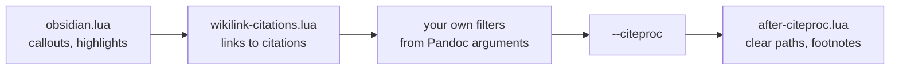

# Architecture

Due Credit turns a note into pandoc's input, runs pandoc, and writes the file
you chose. It writes nothing in the vault and talks to nothing but pandoc.

## Layers

| Path | What it holds |
| --- | --- |
| `src/core/` | Every decision. Pure: no Obsidian imports except type-only ones, no filesystem. Every file has a test named after it. |
| `src/commands/export.ts` | The export: checks the settings, reads the note, asks where to save, runs pandoc, reports back. |
| `src/pandoc.ts` | Running pandoc, and writing its files to a temporary folder. |
| `src/ui/` | The confirmation dialog and the settings tab. |
| `src/main.ts` | Registers the four commands and the file menu items. |
| `pandoc/` | The Lua filters, bundled into `main.js` as text. |
| `fonts/` | Open Sans, bundled into `main.js` as bytes, for PDF. |

### Core

| File | What it decides |
| --- | --- |
| `prepare.ts` | Every step from a note to pandoc's input, in order. See [Pipeline](pipeline.md). |
| `markdown.ts` | The individual rewrites: comments, tags, block IDs, footnotes, headings, images, links to paper notes. |
| `citations.ts` | Reading a `.bib`, a link's key, and which links are about to lose their citation. |
| `document.ts` | The document's metadata, pandoc's arguments for each format, and which arguments of yours are refused. |
| `paths.ts` | Settings paths, `~`, and whether a path is inside the vault. |
| `settings.ts` | The settings shape, defaults and loading. |

**Every decision belongs in `core/`.** `commands/` and `ui/` wire it to
Obsidian and decide nothing.

## An export, from start to finish

1. **Check the settings.** The bibliography, Word template and citation style
   have to exist; your pandoc arguments can't include a refused one, or a word
   pandoc would read as a file (`pandoc --dump-args`). Each failure is a
   sentence saying what to do.
2. **Read the note**, from the editor when it's open, because the file can be a
   moment behind what you just typed.
3. **Prepare it** with `prepare`: the note as pandoc's markdown, its metadata,
   and the links about to lose their citation.
4. **Confirm** the lost citations, if there are any.
5. **Ask where to save**, with Electron's save dialog (through `remote`, as
   Obsidian's own PDF export does), and refuse a path inside the vault, by real
   path, so a symlink can't get around it.
6. **Run pandoc** with the note on stdin, from a temporary folder holding the
   filters, the Markdown template, the font and the metadata. The folder is
   removed afterwards.
7. **Report** where the file went, with Open and Show in folder, and pandoc's
   warnings if there were any.

## How pandoc is run

The note goes in on stdin, and its metadata in a file of its own. Pandoc reads a
block between `---` lines as metadata wherever it is, and in a note that is text
Obsidian shows.

Filters and citeproc run in the order they are given:

- `obsidian.lua` handles Obsidian syntax that needs pandoc's reading of the note
  and has nothing to do with citations.
- `wikilink-citations.lua` has to run before citeproc, which can only cite what
  it has already made.
- Your own arguments come after Due Credit's, so an option of yours wins over
  its default, and before citeproc, so a filter like pandoc-crossref runs where
  it has to.
- `after-citeproc.lua` clears the bibliography's and style's paths, which the
  Word writer would otherwise keep as properties, user name and all. Under a
  footnote style it also finishes footnotes. See
  [Citations](citations.md#footnote-styles).

LaTeX skips citeproc and keeps `\cite` commands instead.

## Bundled files

A plugin ships as one `main.js`, and pandoc takes filters, templates and fonts
as paths. So esbuild bundles the `.lua` files as text and the `.ttf` files as
bytes, and `withFiles` in `src/pandoc.ts` writes them to a fresh temporary
folder for each export.

Open Sans is bundled because few machines have it, and xelatex stops at a font
it can't find. A `mainfont` of your own replaces it.

## Two rules that are written twice

- **What is a citation:** in `wikilink-citations.lua`, and in
  `core/citations.ts` for the check. One table of cases in
  `tests/pandoc.test.ts` runs through both.
- **Whether a style uses footnotes:** `noteStyle` in `core/document.ts`, and
  `note_style` in `after-citeproc.lua`.

Change one side and the other follows.
